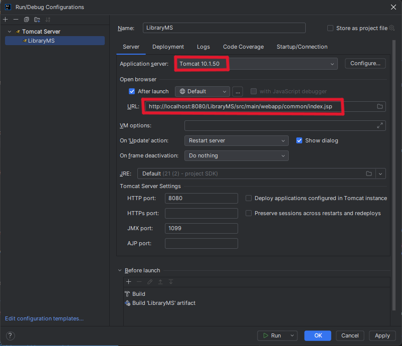
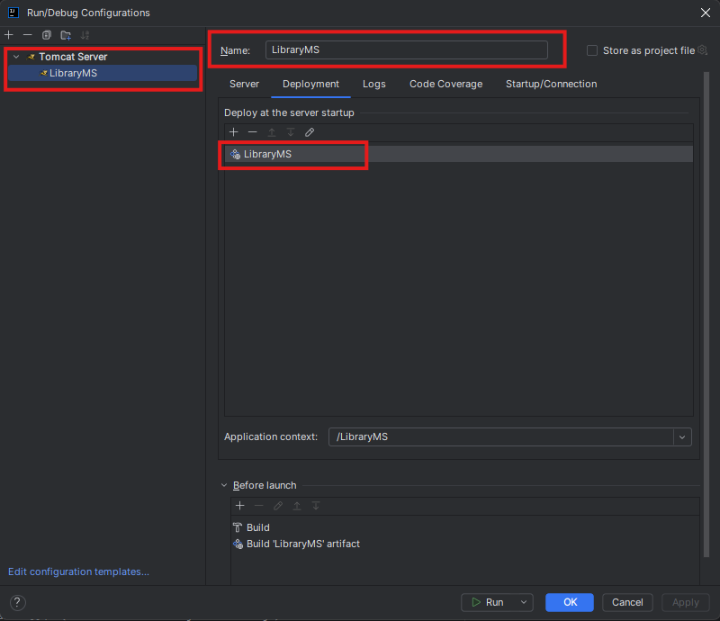

# !!!!!! UNDER DEVELOPMENT !!!!!!

# Library Management System

A project implementing a Library Management System with admin dashboard and student functionalities, using Java servlets, MongoDB and SQL.

## Tech stack
- Java (servlets)
- Maven
- MongoDB
- MySQL

## Prerequisites (Must be exactly as below)
- JDK 21.0.3 => https://download.oracle.com/java/21/archive/jdk-21.0.3_windows-x64_bin.zip
- Maven 
- MongoDB running at \`mongodb://localhost:27017\`
- MySQL, preferably MySQL Workbench (latest version) running at \`localhost:3306\`
- IntelliJ IDEA (recommended for running/deploying)
- Apache Tomcat (latest version)

## Quick start

1. Run in IDE:
    - Deploy built WAR to Tomcat or run via your IDE run configuration as follows:
    - In IntelliJ IDEA, go to Run > Edit Configurations > + > Tomcat Server > Local.
    - Under Deployment tab, click + > Artifact > select \`LibraryMS`\.
    - URL: \`http://localhost:8080/LibraryMS/src/main/webapp/common/index.jsp\`
    - Default Browser: Your choice (preferably Chrome).

    - Make sure to set the correct artifact and server settings:
    - Name the artifact as \`LibraryMS\` if automatically not set (in 99% of cases this will be automatically in the project structure and build).
   

- Start the server.

## Configuration
- Default MongoDB connection is in code: \`mongodb://localhost:27017\`
- Default MySQL connection is in code: \`jdbc:mysql://localhost:3306/libraryms\`
- Modify if necessary in the respective DAO classes.
- For MongoDB -> DB name: \`dbLibraryMS\`
- All MongoDB collections should be created manually in MongoDB Compass with the exact name matching those in MongoDB-data-Json folder in project root (refer to ReadTHIS.txt file in MongoDB-data-Json directory).
- Collections: \`BorrowReturnHist\`, \`Fines\`... Find the rest in MongoDB-data-Json directory.
- For MySQL, find the SQL Schemas scripts in src/main/SQL_Schemas/schema.sql
- In src/main/java/configs/DatabaseConfig.java file, modify database name to switch between different backends (mongodb or sql) where necessary.

## Usage
- Access the application at: \`http://localhost:8080/LibraryMS/src/main/webapp/common/index.jsp`
- Login as Admin (default admin credentials for both databases are username: admin password: admin123).
- Student registration/login pages are available on the landing page via call-to-action buttons.
- Explore admin dashboard and student functionalities.
- Admin can;
1. Manage books
2. View reports
4. Handle fines

- Students can;
1. Register/Login
2. Search/Borrow/Return/Extend books
3. View borrowing history and fines
4. Update profile

## Notes
- Ensure MongoDB is running before starting the application.
- Modify MongoDB connection settings in the code if necessary.
- Ensure Tomcat server is properly configured as provided, in your IDE.
- Ensure required collections (i.e. Admin) and mock data (provided in MongoDB-data-Json folder) are present in MongoDB for full functionality.
- For any questions on functionality, refer to "Watch Demo" button on the landing page for a demo video.
